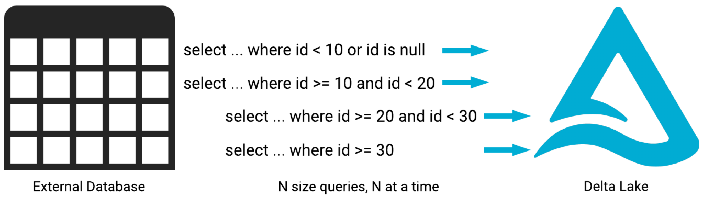

# Lakehouse Federation Bulk Ingest

Provides a mechanism for ingesting large tables into Databricks via [Lakehouse Federation](https://docs.databricks.com/en/query-federation/index.html). It works by dynamically generating N queries that each retrieve a range from the source table. The query ranges are contiguous and don't overlap. The queries are then executed N (Default is 8) at a time in a Databricks Job [foreach task](https://docs.databricks.com/en/jobs/for-each.html).



## Getting Started

**Setup Lakehouse Federation**  
Follow the [Lakehouse Federation](https://docs.databricks.com/en/query-federation/index.html) instructions to create a connection and foreign catalog.

**Add Create Statement for Target Table**  
Add create table statement to text file as shown in [config/ddl_create_lakefed_tgt.txt](config/ddl_create_lakefed_tgt.txt). Placeholders in the statement are replaced with job parameters during runtime, so that these values only need to be specified once. Use the path to the file as the value for the `tgt_ddl_file_path` job parameter.

**Oracle Configuration**  
Ingesting from Oracle requires permission to read the sys.dba_segments table. This is to obtain the source table size.

**PostgreSQL Configuration**  
The number of queries used for ingestion is determined in part by the size of the source table. Since Lakehouse Federation doesn't currently support PostgreSQL object size functions (E.g., pg_table_size), you need to create a view in the source database or use JDBC pushdown. Creating a view in the source database is recommended.

1. Database view - create a view in the source database using the statement below. Leave the `jdbc_config_file` job parameter blank, and the view will be queried using Lakehouse Federation.

```sql
create or replace view public.vw_pg_table_size
 as
 select
  table_schema,
  table_name,
  pg_table_size(quote_ident(table_name)),
  pg_size_pretty(pg_table_size(quote_ident(table_name))) as pg_table_size_pretty
from information_schema.tables
where table_schema not in ('pg_catalog', 'information_schema')
and table_type = 'BASE TABLE';
```

2. JDBC pushdown - create a config file like [config/postgresql_jdbc.json](config/postgresql_jdbc.json). Use the path to the file as the value for the `jdbc_config_file` job parameter. [Secrets](https://learn.microsoft.com/en-us/azure/databricks/security/secrets/) must be used for JDBC credentials. See [notebooks/manage_secrets.ipynb](notebooks/manage_secrets.ipynb) for reference.

## Limitations
- Does not handle skew. The solution works best when the partition column has an even distribution.
- Does not provide atomicity. Individual queries are not executed as a single transaction. One could fail while the rest succeed.

## Deploy Project as a Databricks Asset Bundle (DAB)

1. Install the Databricks CLI from https://docs.databricks.com/dev-tools/cli/databricks-cli.html

2. Authenticate to your Databricks workspace, if you have not done so already:
    ```
    $ databricks configure
    ```

3. To deploy a development copy of this project, type:
    ```
    $ databricks bundle deploy --target dev
    ```
    (Note that "dev" is the default target, so the `--target` parameter
    is optional here.)

    This deploys everything that's defined for this project.
    For example, the default template would deploy a job called
    `[dev yourname] lakefed_ingest_job` to your workspace.
    You can find that job by opening your workpace and clicking on **Workflows**.

4. Similarly, to deploy a production copy, type:
   ```
   $ databricks bundle deploy --target prod
   ```

   Note that the default job from the template has a schedule that runs every day
   (defined in resources/lakefed_ingest_job.yml). The schedule
   is paused when deploying in development mode (see
   https://docs.databricks.com/dev-tools/bundles/deployment-modes.html).

5. To run a job or pipeline, use the "run" command:
   ```
   $ databricks bundle run
   ```

6. Optionally, install developer tools such as the Databricks extension for Visual Studio Code from
   https://docs.databricks.com/dev-tools/vscode-ext.html. Or read the "getting started" documentation for
   **Databricks Connect** for instructions on running the included Python code from a different IDE.

7. For documentation on the Databricks asset bundles format used
   for this project, and for CI/CD configuration, see
   https://docs.databricks.com/dev-tools/bundles/index.html.

## Contributing

**Create and Activate Virtual Environment**
```
$ python3 -m venv ./.venv
```

```
$ source .venv/bin/activate
```

**Run Unit Tests**

Databricks Connect is required to run some of the unit tests. 

1. Install dependent packages:
```
$ pip install -r requirements-dev.txt
```

2. Run unit tests with pytest
```
$ pytest
```

If you run into this error:
```
ERROR tests/main_test.py - Exception: Cluster id or serverless are required but were not specified.
```

Add the cluster_id to your .databrickscfg file
```
[DEFAULT]
host       = https://adb-XXXXXXXXXXXXXXX.XX.azuredatabricks.net/
cluster_id = XXXX-XXXXXX-XXXXXXXX
auth_type  = databricks-cli
```